# HMC vs PIMC erster Vergleich

## Autokorrelationsplots

### Autokorrelation von HMC bei T = 0.5
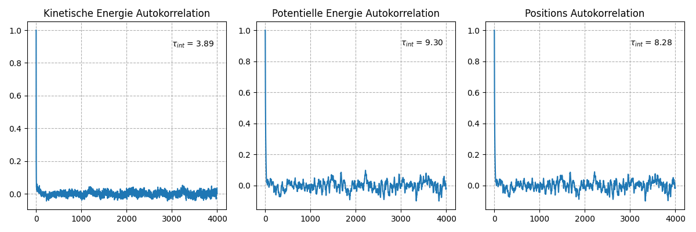

### Autokorrelation von HMC bei T = 10.0
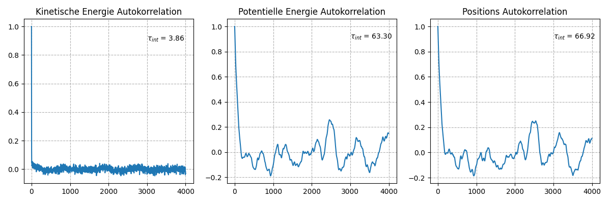

### Autokorrelation von PIMC bei T = 0.5
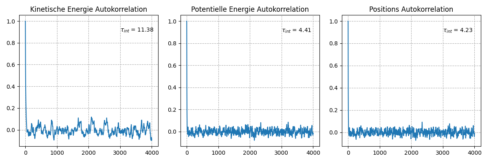

### Autokorrelation von PIMC bei T = 10.0
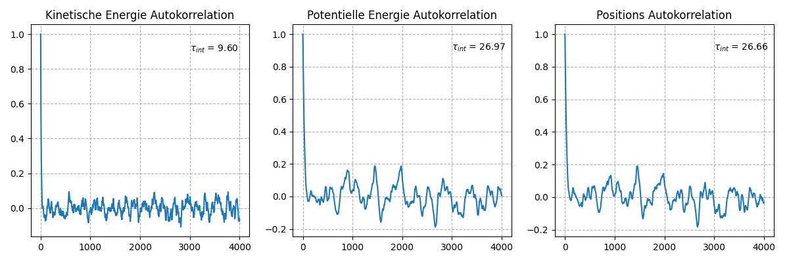

#### $\tau_{int}$ beschreibt die mittlere Zeit (Anzahl der Schritte) bis die Messdaten wieder unabhänig von einander sind.

#### es fällt auf das vor allem die Autokorrelation der Potenziellen Energie sowohl beim HMC und bei PIMC mit der Temperatur stark ansteigen. Somit wird die effektive Anzahl der Messpunten kleiner und die Unsicherheit der Potenziellen Energie steiht mit der Temperatur an.

#### im vergleich hat der HMC eine geringeres $\tau_{int}$ bei der Kinetischen Energie wie der PIMC, diese ändert sich mit der Temperatur auch kaum. Dafür ist das $\tau_{int}$ der Poteziellen Energie und somit auch der Position größer wie bei PIMC. In dem man die Anzahl der Leapfrog Schritte erhöht nimmt die Autokorrelation ab, aber natür die Rechenzeit zu (weitere Test nötig um Optimum zu finden)

## HMC vs PIMC Mittelwert über Rechenzeit

#### HMC T = 0.5

#### PIMC T = 0.5

#### Auf dem ersten Blick scheint es das der HMC eine viel größere Rechenzeit als der PIMC hat. Jedoch fällt auf das der HMC nach ca. 2000 Schritten bereits eine ähnliche Unsicherheit der Kinetischen Energie hat wie der PIMC nach 10000 Schritten und bei der Potenziellen Energie nach ca. 6000 Schritten. Somit sind zumindestes bei der Temperatur von 0.5 die Rechenzeiten für ähnlich Unsicherheiten der kinetischen Energie geringer wie beim HMC als bei PIMC, aber für die Potenzielle Energie ist die Rechenzeit für ähnliche Unsicherheiten beim PIMC noch schneller (hier ca. 11s beim HMC und 4 beim PIMC)

## Observalenmittelwerte über Temperatur

### Potentielle und Kinetische Energie Mittelwerte mt HMC bestimmt.
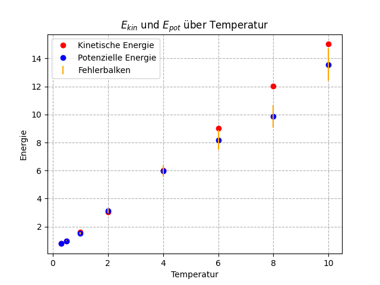

### Potentielle und Kinetische Energie Mittelwerte mt PIMC bestimmt.
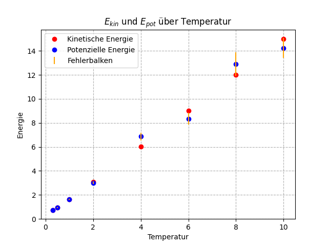

#### laut Viralsatz erwartet man das bei einem Harmonischen Potenzial die Kinetische Energie gleich der Potenziellen Energie entspricht dies ist bei niedrigen Temperaturen auch noch sehr genau erfüllt, bei hohen Temperaturen steigt die Unsicherheit der Potenziellen Energie sowhol beim HMC und bei PIMC stark. Beim HMC sieht es aus das eine systematische Abweichung der Potenziellenenegie nach unten vorliegt.

#### wärend bei HMC die Unsicherheiten der Potenziellen Energie bei höheren Temperaturen (T =8, 10) etwas größer sind wie beim PIMC, sind aber die Unsicherheiten der Kinetischen Energie bei PIMC viel kleiner sodass man die Fehlerbalken nicht im Plot erkennen kann

### Um zu prüfen ob systematische Abweichung vorliegt habe ich den HMC und PIMC mit gleichen Inputparametern aber mehr Montecarloschritten (N =50000) ausgeführt.

### HMC:
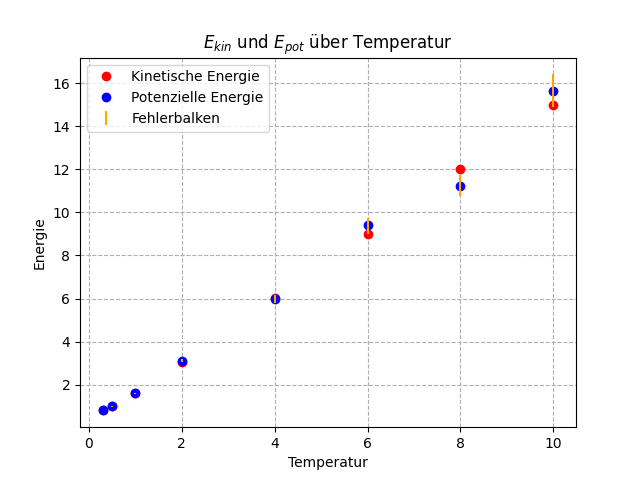

### PIMC:
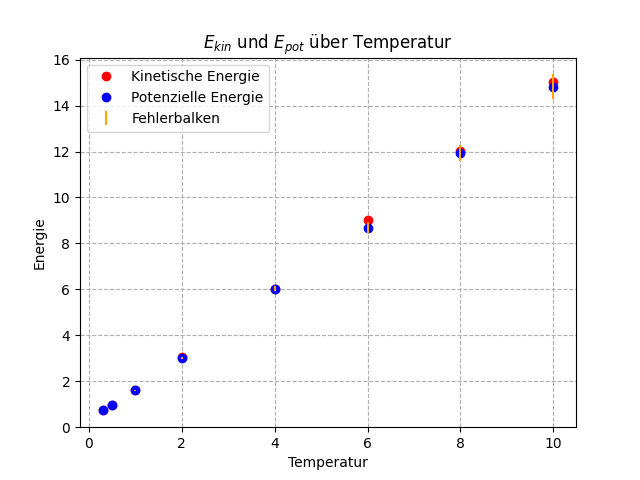

### zu sehen ist das die Unsicherheiten auch bei höheren Temperaturen, wesendlich nachgelassen haben und der Viralsatz für PIMC und HMC für alle geplotteden Temperaturen innerhalb der Unsicherheiten erfüllt ist. Zusätzlich sieht man das keinesystematische Abweichung der Potentiellen Energie beim HMC vorliegt.

### Das Lineare Wachstum der Kinetischen Energie mit der Temperatur ist auch logisch, da sich die Freiheitsgrade nicht änderen und geder Freiheitsgrad eine Energie von $E = ​\frac{1}{2}k_B​T$ liefert.

## Weitere Unsciherheiten über Rechenzeit Plots der 50000 Schritte Reihe:

#### HMC T = 0.5
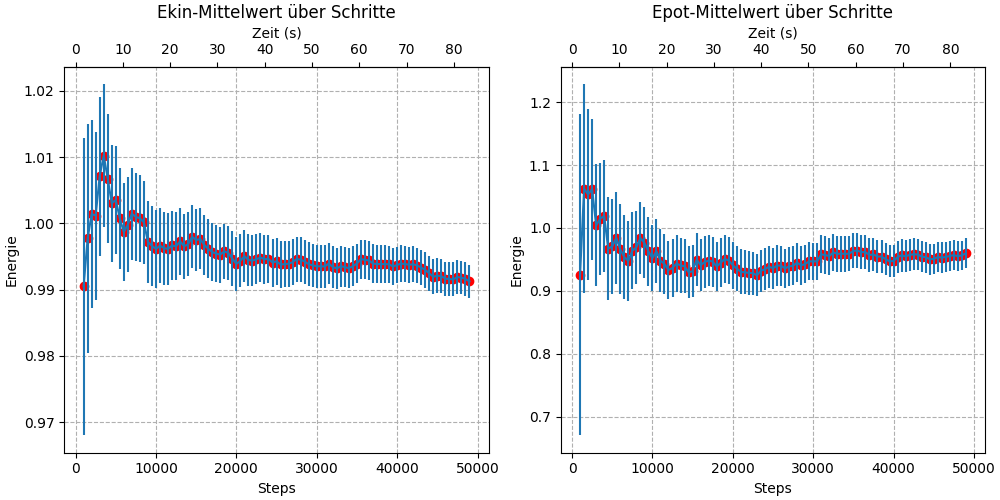
#### HMC T = 10.0
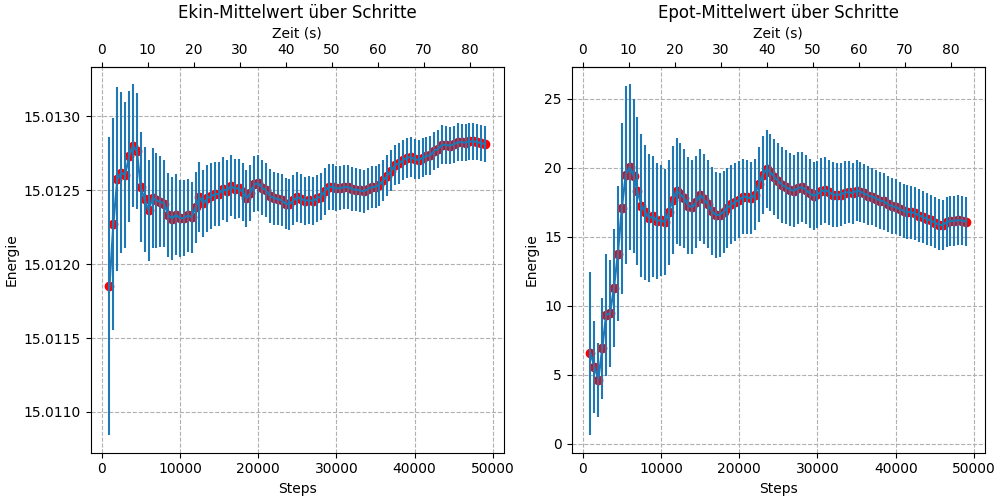

#### PIMC T = 0.5
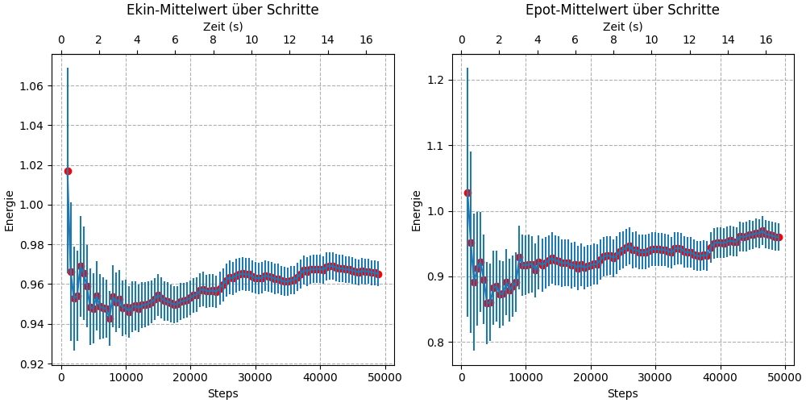
#### PIMC T = 10.0
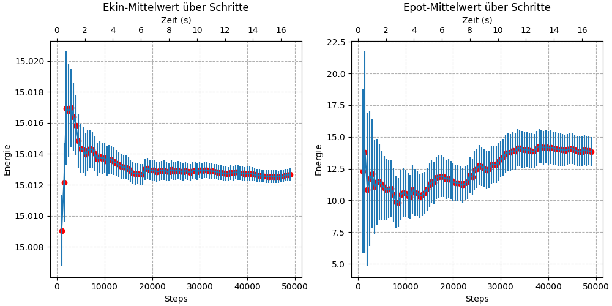

### Bei PIMC und HMC ist zu sehen die Potenzielle Energie bei kleinen Temperaturen genauer bestimmt wird als bei größen temperaturen und bei der Kinetischen Nergie ist es genau andersherum

## Beispielplots der kinetischen und Potenziellen Energie vom PIMC
### $N$ = 10000 (Montecarlo-Steps)

## Beispielplots der kinetischen und Potenziellen Energie vom HMC
### Parameter: $\Delta t$ = 0.03 ,  $L$ = 100 (Leapfrog-Steps), $N$ = 10000 (Montecarlo-Steps) ,   $\mu$ = 2

