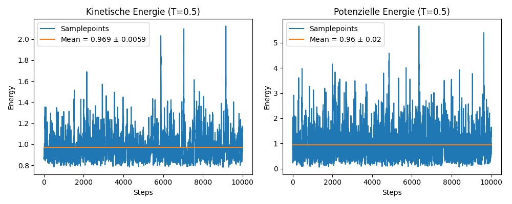
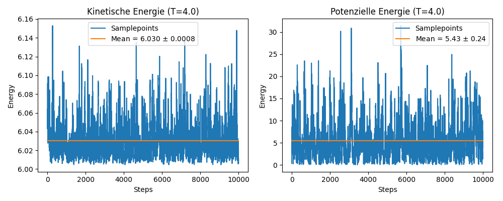
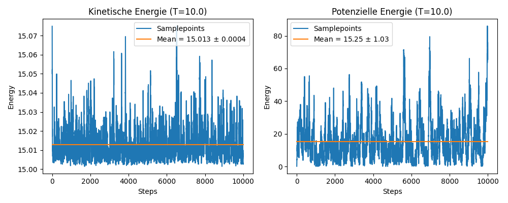
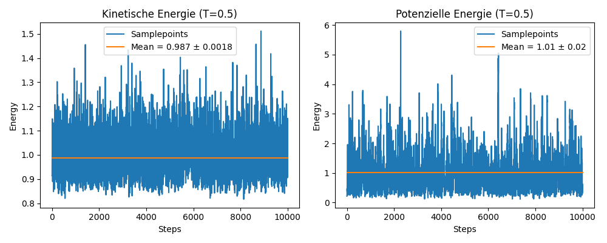
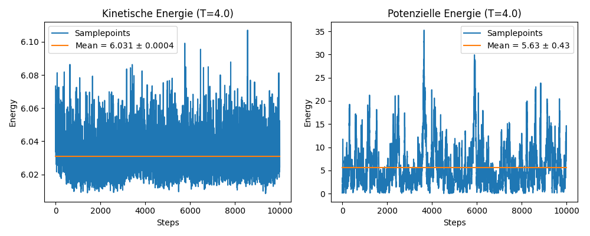
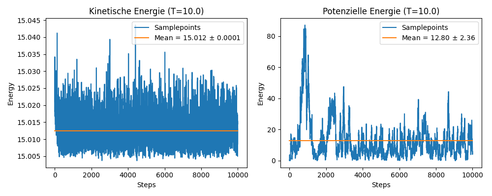
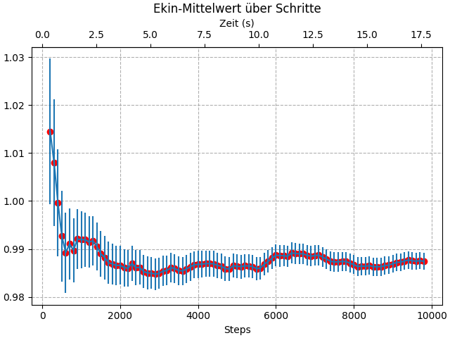
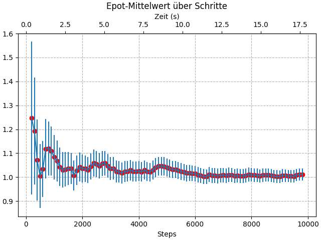
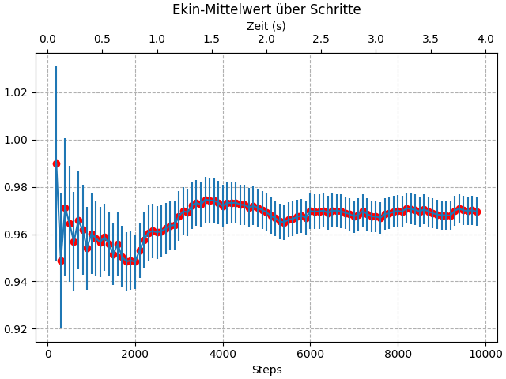
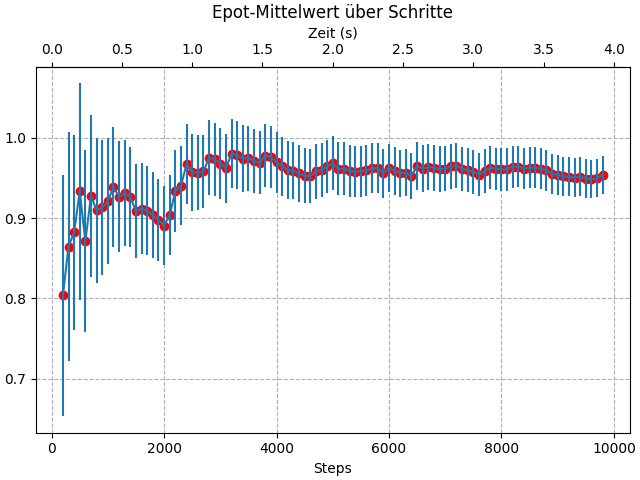

# HMC vs PIMC erster Vergleich

## Beispielplots der kinetischen und Potenziellen Energie vom PIMC
### $N$ = 10000 (Montecarlo-Steps)

## Beispielplots der kinetischen und Potenziellen Energie vom HMC
### Parameter: $\Delta T$ = 0.03 ,  $L$ = 100 (Leapfrog-Steps), $N$ = 10000 (Montecarlo-Steps) ,   $\mu$ = 2

## Autokorrelationsplots und Mittelwert über Rechenzeit

### HMC vs PIMC Rechenzeit

#### HMC T = 0.5

#### PIMC T = 0.5

#### es fällt auf das ber PIMC für gleich viele Montecarlo schritte viel weniger Rechenzeit braucht. Wenn man jedoch auf die Unsicherheiten der Mittelwerte schaut sieht man das der HMC bereits nach ca. 3000 Schritten ähnliche Unsicherheiten hat wie der PIMC und sich somit die Rechen Zeiten mit 5.5s beim HMC und 4s beim PIMC für die selben Unsicherheiten nicht mehr so stark unterscheiden. 
## Observalenmittelwerte über Temperatur
